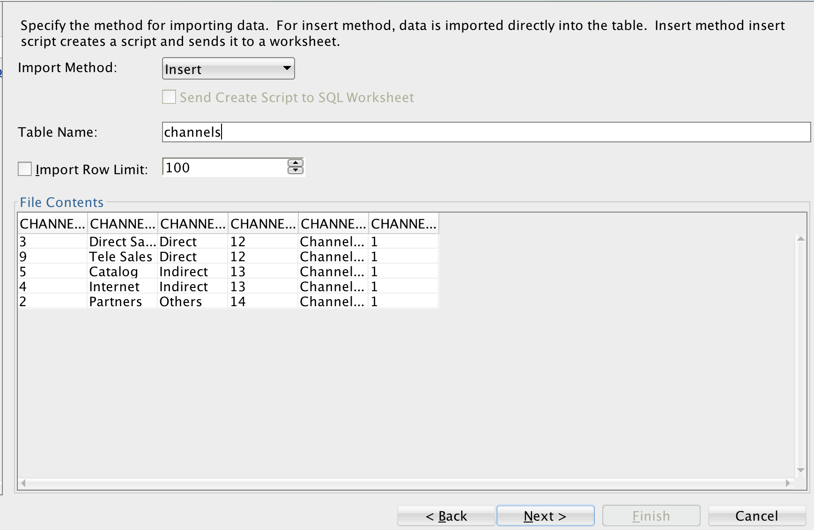

# REST API for SaaS Applications

## Objective

In this lab we will create REST APIs using Python Flask that is connected to Autonomous Database. 
It can be used by different SaaS applications. 

## Pre-requisites

- The following lab requires an Oracle Public Cloud account with Autonomous Data Warehouse Cloud Service.

- You need to have a connection to database through admin in your SQL Developer. 

    - Open up your SQL Developer and create a new connection for admin. If you already have a connection, skip this step. 

    - Enter the following details for admin:

        1.	Connection Name: GIve any connection name
        2.	Username: admin (or any DB user)
        3.	Password: Password you entered while creating database on cloud.
        4.	Connection Type: Cloud PDB
        5.	Configuration File: Path to your wallet
        6.	Keystore Password: Password entered while downloading wallet. 

        

    - Click on Test, if it shows success, click on save and then click on connect. 
    
- You should have your local environment configured with instant client and the wallet. 
  If it's not, download and follow the instructions in this file. [Configure Instant Client & Wallet](configureIC.docx)

### **Step 1**: Create channels table in Autonomous Database.

- Download the csv file. [channels.csv](Data/channels.csv)

- Upload data from the following csv file in your autonomous database.

    1. Right click on **table** and then **import data**.

        
        
    2. Leave the source as **Local File**, click on Browse and select the downloaded csv file.
    
        
        
    3. Give table name as "channels".
    
        

    4. Click on next till you reach the review page and click on finish. Table is created and the data is loaded.
    
### **Step 2**: Download and configure the script.

- Download the following script [app.py](app.py)

- Open this script and change the following parameter in the code:

    **username = "Your username"  
    password = "Your password"  
    service_name = "Your service name"**
    
- now run the script as **python app.py**
  

### **Step 3**: Run the application.

- Set environment variable "FLASK_APP" to the path of the app.py
  
  **export FLASK_APP=path to app.py**
  
- Type following command in command line:

  **flask run --host=0.0.0.0 --port=5000**

- Now open any web browser and type **"localhost:5050/channels"**

  You will see channels information on the browser. 
  
  You can also deploy this application in a compute instance and can use the REST API in SaaS Applications.

